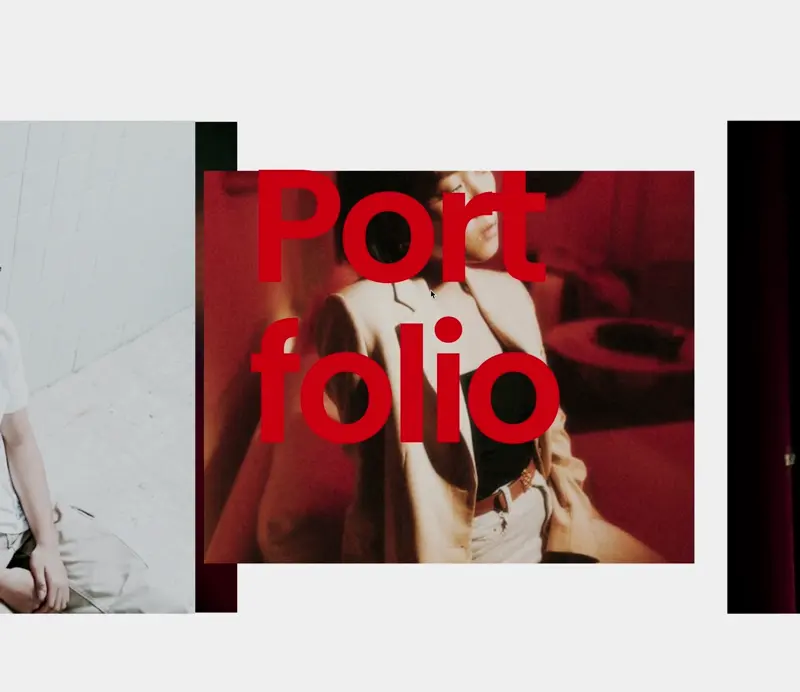

# NextJS React TypeScript infinite animated slider with React-Three-Fiber

This infinite scroll animated slider is built using NextJS, React with TypeScript, and React-Three-Fiber. It showcases a 3D interactive slider section using React-Three-Fiber and React Scroll Controls.

## Description

The project aims to create an interactive portfolio website with a unique slider section. The slider section is a 3D environment where users can scroll horizontally through multiple slides, each containing images and text.

### Interactive 3D Slider Section

The slider utilizes React-Three-Fiber to create a dynamic 3D environment. Users can scroll horizontally through different slides, each containing images and text. The images are displayed using the `DreiImage` component, which reacts to scroll events to provide a parallax effect. Text slides are also included to provide additional information or messages.

## Key Features

### Horizontal Scrolling Slides

- The slider section consists of multiple slides that can be scrolled horizontally.
- Each slide contains images and/or text related to the portfolio or project being showcased.
- Users can scroll through the slides using the horizontal scroll controls provided by React Scroll Controls.

### Parallax Effect for Images

- Images within the slides react to scroll events, providing a parallax effect.
- The `DreiImage` component dynamically adjusts its position and grayscale based on the user's scrolling behavior, creating a visually engaging experience.

### Text Slides

- In addition to image slides, text slides are included to provide information or messages to the user.
- Text slides are positioned within the 3D environment and scroll horizontally along with the image slides.

## Usability

The portfolio website offers an immersive and visually stunning experience for users to explore the showcased projects. The horizontal scrolling functionality allows users to navigate through the slides effortlessly, while the parallax effect adds depth and interactivity to the images. The inclusion of text slides provides context and enhances the storytelling aspect of the portfolio.

## Dependencies

The project utilizes the following dependencies:

- **@react-three/drei**: Provides components and hooks for working with React-Three-Fiber.
- **@react-three/fiber**: The core library for creating 3D scenes with React.
- **react**: The core library for building user interfaces with React.
- **react-dom**: Provides DOM-specific methods for React.
- **three**: The library used for creating and displaying 3D content.
- **typescript**: Adds static typing to JavaScript.

## Usage

To run the project locally, you can follow these steps:

1. Clone the repository to your local machine.
2. Navigate to the project directory.
3. Install dependencies using `npm install` or `yarn install`.
4. Start the development server using `npm run dev` or `yarn dev`.
